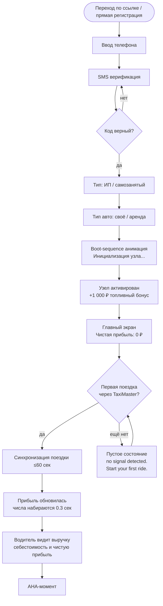
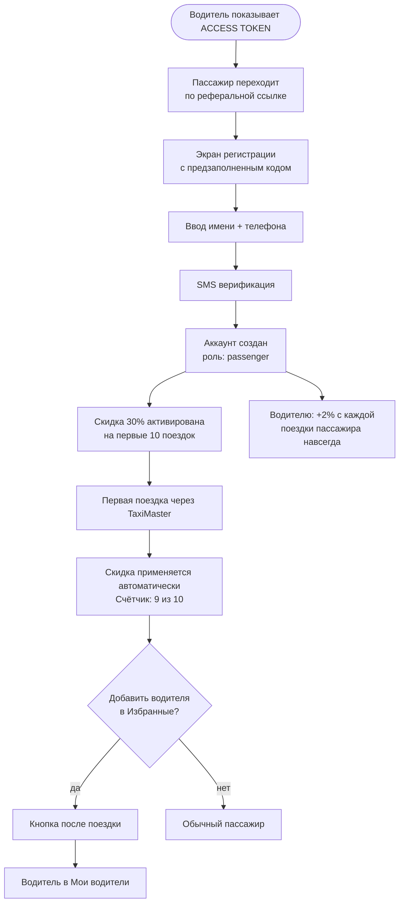
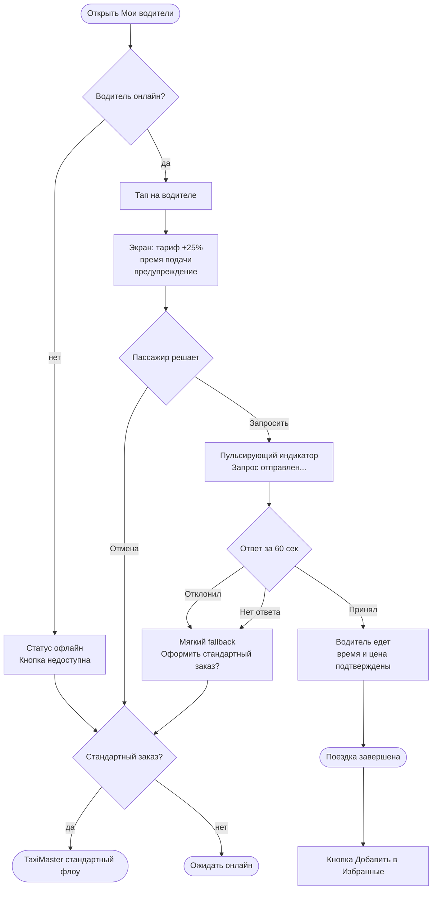
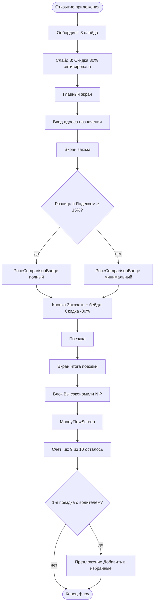
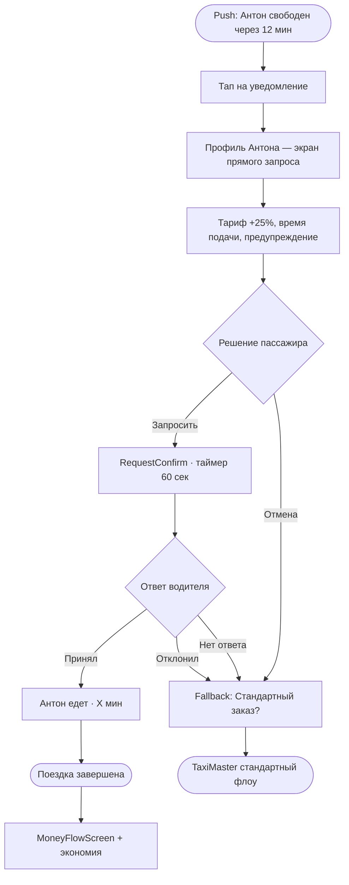

# UX Design Specification EasyGo

**Author:** Elnur
**Date:** 2026-04-21

---

## Executive Summary

### Project Vision

EasyGo — децентрализованная кооперативная платформа такси, где водитель является совладельцем, а не наёмником. 0% комиссии. Полная прозрачность финансов. Слоган для пассажиров: "Твой водитель. Без посредников. Дешевле."

UX-метафора платформы: открытый код такси. Как open-source даёт пользователям root access к системе — EasyGo даёт водителям и пассажирам полный доступ к данным, которые агрегаторы обычно скрывают.

### Target Users

**Водитель-автопредприниматель (ИП / самозанятый)**
- Устал от 25–30% комиссии агрегаторов
- Хочет видеть реальную прибыль, а не "выручку"
- Не готов рисковать — стратегия нулевого риска (работает параллельно)
- Идентичность: не таксист-наёмник, а предприниматель-совладелец

**Пассажир**
- Хочет дешевле и надёжнее
- Ценит прямую связь с "своим" водителем
- Готов быть частью чего-то нового (анти-монопольный мотив)

**Основатель / Администратор**
- Управляет платформой через мастер-панель
- Контролирует прозрачность: что видят водители, когда и сколько

### Design Language: 10% Cyber Rule

Базовый интерфейс — чистый, профессиональный, интуитивный. Кибер-эстетика (децентрализация + Kali Linux + фиолетовые акценты) появляется только в 6 ключевых точках:

| Момент | Эффект |
|--------|--------|
| Реферальный код | Моноширинный шрифт + фиолетовое свечение |
| Загрузка дашборда | Числа "набираются" 0.3 сек |
| Пинг Избранного водителя | Пульсирующий индикатор |
| Публичный отчёт /open-finance | Фоновый лог-эффект |
| Пустые состояния | "No signal detected. Start your first ride." |
| Онбординг-финал | Boot-sequence прогресс + "Узел активирован" |

### Key Design Challenges

1. **Доверие vs новизна** — водитель привык к Яндексу. Первый экран должен за 3 секунды передать: "Здесь тебя не обманут."
2. **Данные без перегрузки** — прибыль, себестоимость, Цифровой Пай, рефералы — всё важно, но всё сразу = хаос.
3. **Избранный водитель** — сложный флоу из 6 шагов. Нужно сделать его интуитивным и не пугающим пассажира ценой (+20–30%).

### Design Opportunities

1. **Реферальный код как ACCESS TOKEN** — не купон, а персональный ключ к сети. Визуально особенный. Создаёт гордость и желание делиться.
2. **Водитель = Узел сети** — язык совладения через метафору децентрализации. Цифровой Пай = вес узла. Граф рефералов — потенциальная визуализация.
3. **Финансовая прозрачность как конкурентное преимущество** — публичный отчёт /open-finance стилизован как живой лог. Ощущение: "Мы ничего не прячем. Смотри сам."

---

## Core User Experience

### Defining Experience

Водитель каждое утро открывает кабинет с одним вопросом: "Сколько я заработал вчера?" Это его самое частое действие. Если это занимает больше 2 секунд или требует ручного подсчёта — он уходит обратно в Яндекс.

Пассажир хочет одного: нажать на имя своего водителя и поехать с ним. Всё остальное — вторично.

Администратор утром смотрит на дашборд: всё работает? Сколько водителей онлайн? Один экран. Ноль кликов.

### Platform Strategy

| Пользователь | Основная платформа | Контекст использования |
|---|---|---|
| Водитель | Мобильный + Web | В машине (мобайл), дома (детальная аналитика) |
| Пассажир | Мобильный | На ходу, перед поездкой |
| Администратор | Web Desktop | Рабочее место, мониторинг |

### Effortless Interactions

- Водитель видит чистую прибыль — без формул, без калькулятора
- Пассажир одним тапом копирует реферальный код водителя при регистрации
- Избранный водитель — его статус виден сразу на главном экране пассажира
- Реферальный код — один тап "поделиться", сразу в мессенджер

### Critical Success Moments

1. **Водитель впервые видит чистую прибыль** — "Вот это сколько я на самом деле зарабатываю." Этот момент должен вызывать гордость, не шок.
2. **Первое реферальное начисление** — уведомление: "Максим совершил поездку. Тебе начислено 17 ₽." Пассивный доход стал реальным.
3. **Пассажир завершил первую поездку с Избранным водителем** — ощущение: "Это мой водитель. Он знает меня."
4. **Водитель завершил регистрацию** — "Узел активирован." Он часть чего-то большего.

### Experience Principles

1. **Прозрачность без объяснений** — данные говорят сами за себя. Никаких тултипов со звёздочками.
2. **Доверие через первый экран** — пользователь решает остаться или уйти за 7 секунд.
3. **Мобайл-первый для действий, веб — для понимания** — заказ/принятие на телефоне, аналитика на десктопе.
4. **10% кибер-эстетика в точках гордости** — реферальный код, первый вход, Цифровой Пай.
5. **Ноль лишних шагов** — каждый лишний тап = потеря водителя к Яндексу.

---

## Desired Emotional Response

### Primary Emotional Goals

| Пользователь | Должен чувствовать | Не должен чувствовать |
|---|---|---|
| Водитель | Гордость, контроль, принадлежность | Замешательство, недоверие |
| Пассажир | Тепло, связь, выгоду | Тревогу, сложность |
| Основатель | Уверенность, порядок | Хаос, слепоту |

### Emotional Journey Mapping

**Водитель:**
- Первый контакт — скептицизм: "ещё один стартап?" → любопытство: "подожди, 0% комиссии?"
- Регистрация — облегчение: "я ничем не рискую, работаю параллельно"
- Первый дашборд — удивление → гордость: "вот сколько я на самом деле зарабатываю"
- Первое реферальное начисление — восторг: "пассивный доход существует"
- Долгосрочно — принадлежность: "я совладелец, не наёмник"

**Пассажир:**
- Первый контакт (через водителя) — любопытство: "мой водитель рекомендует — значит стоит попробовать"
- Скидка 30% — приятное удивление: "мне дают, а не берут"
- Первая поездка — облегчение: "работает и дешевле"
- Первая поездка с Избранным — тепло и связь: "это мой водитель, он меня помнит"

### Micro-Emotions

| Эмоция | UX-решение |
|---|---|
| Гордость | Большие чёткие числа прибыли, анимация при первом просмотре |
| Принадлежность | Язык "мы", "наша сеть", "твой узел" — не "пользователь #4521" |
| Доверие | Данные без звёздочек и сносок, публичный отчёт |
| Связь | Имя водителя везде — не безликое "водитель" |
| Восторг | Уведомление о реферале как маленький праздник |
| Спокойствие при ошибке | "Нет сигнала — последние данные от 14:32" — не красный экран |

### Design Implications

- **Гордость** → большие цифры прибыли на главном экране, счётчик нарастает при загрузке
- **Принадлежность** → персональный язык: "твой узел", "твои рефералы", "твой водитель"
- **Доверие** → данные без объяснений, ноль скрытых условий, публичная страница `/open-finance`
- **Восторг** → push-уведомление о реферале оформлено как событие, а не системное сообщение
- **Спокойствие** → ошибки показывают последнее известное состояние, не пустой экран

### Emotional Design Principles

1. **Гордость важнее красоты** — водитель должен хотеть показать кабинет другу
2. **Тепло в деталях** — имена, не номера; "твой" вместо "назначенный"
3. **Удивление в правильный момент** — реферальное начисление = маленький праздник, не строка в таблице
4. **Доверие через предсказуемость** — система делает то что обещала, каждый раз
5. **Ошибка = пауза, не катастрофа** — технические сбои не вызывают тревогу

---

## UX Pattern Analysis & Inspiration

### Inspiring Products Analysis

**Revolut** — финансовый дашборд: числа крупно, обновление в реальном времени, тёмная тема опционально. Пользователь видит деньги — не отчёт. Применимо к кабинету водителя.

**inDrive** — такси где водитель имеет контроль над ценой и выбором заказа. Философия близка к EasyGo: водитель — активный участник, не исполнитель. Изучаем их флоу принятия заказа.

**Telegram** — антиэстаблишмент, приватность, доверие. Быстрый, без лишнего. Сообщество как ценность. Вдохновение для языка платформы и ощущения "своих".

**Vercel Dashboard** — тёмный UI, developer-feel, данные как главный герой. Минимализм + мощь. Референс для мастер-панели администратора.

**Open Collective** — открытые финансы кооператива в реальном времени. Прозрачность как фича, не исключение. Прямой референс для `/open-finance`.

### Transferable UX Patterns

**Навигация:**
- Revolut: bottom tab bar с 4–5 разделами — водитель переключается одним большим пальцем
- Vercel: боковое меню только на десктопе, мобайл = bottom nav — применяем по платформам

**Взаимодействие:**
- inDrive: принятие заказа = одно большое действие, без вложенных шагов — адаптируем для Избранного водителя
- Revolut: push-уведомление о транзакции как событие с суммой и именем — адаптируем для реферальных начислений
- Telegram: статус онлайн как зелёная точка — применяем для пинга Избранного водителя

**Визуальные паттерны:**
- Vercel + Linear: тёмный фон (#0d0d0d или #111) + белый текст + один акцентный цвет — наш акцент = фиолетовый
- Revolut: крупные числа как главный элемент экрана — прибыль водителя на весь экран
- Open Collective: таблица транзакций как живой лог — реферальные начисления в том же стиле

### Anti-Patterns to Avoid

- **Яндекс Go driver app**: перегруженный дашборд, комиссия спрятана в деталях — делаем наоборот
- **Сложный онбординг с 7+ шагами** — водитель уйдёт на шаге 3; максимум 4 шага
- **Модальные окна поверх модальных** — особенно опасно в флоу Избранного водителя
- **Числа без контекста** — "850 ₽" без понимания за что = недоверие; всегда показываем период
- **Красные экраны ошибок** — разрушают доверие; используем нейтральный серый + объяснение

### Design Inspiration Strategy

**Принять:**
- Крупные числа как главный элемент (Revolut) → дашборд водителя
- Зелёная точка статуса (Telegram) → пинг Избранного водителя
- Тёмный фон + один акцент (Vercel/Linear) → общая палитра
- Push как событие с именем (Revolut) → уведомление о реферале

**Адаптировать:**
- Флоу принятия заказа (inDrive) → упростить для Избранного водителя: 1 экран, 2 кнопки
- Открытые финансы (Open Collective) → добавить кибер-эстетику лога для `/open-finance`

**Избегать:**
- Перегруженный дашборд агрегаторов → один главный показатель на первом экране
- Скрытые условия и звёздочки → всё видно сразу, без раскрытий

---

## Design System Foundation

### Design System Choice

**shadcn/ui + Tailwind CSS** — темизируемая система с полным контролем над компонентами.

### Rationale for Selection

- Тёмная тема — встроена, первоклассная поддержка
- Фиолетовый акцент — один токен в конфиге применяется глобально
- 10% кибер-эффекты — реализуются через Tailwind классы и CSS custom properties
- Компоненты копируются в проект (не зависят от npm) — полный контроль кода
- Единый стек для Web (React) и Mobile (React Native + NativeWind)
- Скорость MVP: готовые компоненты, кастомизируются под нужды EasyGo

### Implementation Approach

Дизайн-токены EasyGo:

```
--color-bg:          #0d0d0d        (основной фон)
--color-surface:     #141414        (фон карточек)
--color-accent:      #7c3aed        (фиолетовый, Violet-700)
--color-accent-glow: #7c3aed33     (свечение — 20% opacity)
--color-text:        #f4f4f5        (основной текст)
--color-muted:       #71717a        (вторичный текст)
--font-mono:         JetBrains Mono (кибер-моменты: код, токены)
--font-main:         Inter          (весь остальной интерфейс)
```

### Customization Strategy

- **Базовые компоненты** (кнопки, поля, карточки) — shadcn/ui с токенами EasyGo
- **Кибер-компоненты** (реферальный код, boot-sequence, пинг) — кастомные поверх базы
- **Числа и финансы** — крупный шрифт Inter Bold, акцентный цвет для позитивных значений
- **Моноширинные блоки** — JetBrains Mono только в 6 определённых точках (10% правило)

---

## 2. Core User Experience

### 2.1 Defining Experience

EasyGo имеет два определяющих момента — по одному на каждого ключевого пользователя:

**Водитель: "Открыл — увидел сколько заработал"**
Каждое утро водитель открывает кабинет и за 2 секунды знает чистую прибыль. Не выручку — именно чистыми, без комиссии. Это момент когда он понимает: EasyGo честнее.

**Пассажир: "Написал Артёму — Артём приехал"**
Пассажир не заказывает "такси". Он пишет своему водителю. Видит зелёную точку — онлайн. Нажимает "Запросить". Артём принимает. Это личная связь, которой нет у агрегаторов.

### 2.2 User Mental Model

| | Текущая модель (Яндекс) | Модель EasyGo |
|---|---|---|
| Водитель | "Я исполнитель, система решает" | "Я хозяин, я вижу всё" |
| Пассажир | "Любой водитель, лишь бы быстро" | "Мой водитель, мои условия" |

### 2.3 Success Criteria

- Водитель видит чистую прибыль за <2 сек без единого тапа
- Пассажир делает прямой запрос Избранному водителю в 3 тапа
- Оба флоу работают на слабом 4G без подвисаний
- Водитель хочет показать кабинет другу — это мерило гордости

### 2.4 Novel UX Patterns

Комбинация знакомых паттернов в новом контексте:
- Финансовый дашборд (знакомо по Revolut) × данные таксиста (новый контекст)
- Статус онлайн/офлайн (знакомо по мессенджерам) × запрос такси (новый контекст)
- Реферальный код (знакомо) × оформлен как access token (новая эстетика)

Обучение не требуется — паттерны интуитивно понятны, новизна в смысле, не в механике.

### 2.5 Experience Mechanics

**Дашборд водителя:**

1. Инициация: открытие приложения → сразу главный экран с прибылью (без меню)
2. Взаимодействие: числа набираются 0.3 сек → крупная цифра чистой прибыли → ниже: выручка / себестоимость / поездок
3. Обратная связь: зелёный = выше вчерашнего, нейтральный = ниже, никаких красных без причины
4. Завершение: водитель закрывает с уверенностью — он знает свои деньги

**Прямой запрос Избранному водителю:**

1. Инициация: "Мои водители" → список с пинг-статусами онлайн/офлайн
2. Взаимодействие: тап на водителя → экран с тарифом, предупреждением, кнопки "Запросить" / "Стандартный заказ"
3. Обратная связь: "Запрос отправлен..." → пульсирующий индикатор ожидания
4. Завершение: "Артём принял. Едет 12 мин." — или мягкий fallback без стресса

---

## Visual Design Foundation

### Color System

```
ФОНЫ
bg-base:      #0d0d0d   — основной фон
bg-surface:   #141414   — карточки, панели
bg-elevated:  #1c1c1c   — дропдауны, поднятые элементы

АКЦЕНТ (Violet-700)
accent:       #7c3aed   — кнопки, активные состояния
accent-hover: #6d28d9   — hover
accent-glow:  #7c3aed33 — свечение 20% opacity (кибер-момент)

ТЕКСТ
text-primary:   #f4f4f5
text-secondary: #a1a1aa
text-muted:     #71717a

СЕМАНТИЧЕСКИЕ
success: #22c55e   — прибыль, рост, онлайн-статус
warning: #f59e0b   — предупреждение о времени ожидания
error:   #71717a   — ошибки (нейтральный серый, не красный)
```

### Typography System

```
ОСНОВНОЙ: Inter
  h1   32px Bold     — чистая прибыль на дашборде
  h2   24px SemiBold — заголовки разделов
  h3   18px Medium   — подзаголовки карточек
  body 15px Regular  — основной контент
  sm   13px Regular  — метки, даты

КИБЕР (только в 6 точках): JetBrains Mono
  mono-code 14px — реферальный код ACCESS TOKEN
  mono-log  12px — лог-эффект на /open-finance
```

### Spacing & Layout Foundation

```
БАЗОВАЯ ЕДИНИЦА: 4px
  xs 4px   — между иконкой и текстом
  sm 8px   — внутри компонентов
  md 16px  — между компонентами
  lg 24px  — между секциями
  xl 32px  — между крупными блоками

СЕТКА: Mobile-first
  Мобайл:  1 колонка, padding 16px
  Планшет: 2 колонки, padding 24px
  Десктоп: 12 колонок, max-width 1280px

КОМПОНЕНТЫ:
  border-radius sm 6px / md 12px / lg 16px / full 9999px
  без теней — глубина через bg-elevated
  glow только в кибер-моментах: box-shadow 0 0 20px #7c3aed33
  border: 1px solid #27272a (разделители)
  border-accent: 1px solid #7c3aed (активные поля)
```

### Accessibility Considerations

- Контраст text-primary на bg-base: >7:1 (WCAG AAA)
- Акцент #7c3aed на тёмном фоне: 5.2:1 (WCAG AA) ✓
- Ошибки: всегда иконка + текст, не только цвет
- Минимальная касаемая зона: 44×44px (мобайл)

---

## Design Direction Decision

### Design Directions Explored

Три направления исследованы в интерактивном HTML-витрине (`ux-design-directions.html`):

- **NODE** — метафора децентрализованной сети, умеренный кибер, высокая читаемость
- **STARK** — абсолютный минимализм, данные первым, профессиональный вид
- **PULSE** — максимальная кибер-эстетика, сетчатый фон, кольцо-индикатор, лог-эффекты

### Chosen Direction

**NODE как база + точечные элементы PULSE**

### Design Rationale

NODE обеспечивает чёткость и читаемость — критично для водителя который смотрит на цифры в машине. PULSE-элементы добавляются точечно в 6 ключевых кибер-моментах (10% правило):
- Кольцо-индикатор на главном экране (от PULSE)
- Boot-sequence анимация при завершении регистрации (от PULSE)
- Более выраженный glow на реферальном ACCESS TOKEN (от PULSE)
- Базовая структура, навигация, карточки — NODE

### Implementation Approach

- Базовые компоненты: shadcn/ui + Tailwind с токенами NODE
- Кибер-компоненты (6 точек): кастомные CSS-анимации поверх базы
- Иконки навигации: геометрические символы ◈ ◉ ◎ ○ (стиль NODE)
- Сетчатый фон: только на экране регистрации-финала и /open-finance (PULSE)

---

## User Journey Flows

### UJ-1/2: Водитель — онбординг и первая прибыль



### UJ-5: Пассажир — регистрация по реферальному коду водителя



### UJ-6: Пассажир — прямой запрос к Избранному водителю



### Journey Patterns

| Паттерн | Применение |
|---|---|
| Мягкий fallback | Везде где может быть отказ — предлагаем альтернативу, не тупик |
| Пустое состояние с действием | "No signal detected. Start your first ride." |
| Подтверждение перед необратимым | Запрос к Избранному — цена и время до отправки |
| Счётчик прогресса | Скидки "9 из 10" — пассажир видит ценность |
| Таймер ожидания | 60 сек ожидания ответа водителя — явный отсчёт |

### Flow Optimization Principles

1. Максимум 4 шага онбординга — водитель уйдёт на шаге 5
2. AHA-момент (первая прибыль) — достигается автоматически, без лишних тапов
3. Fallback всегда доступен — пользователь никогда не в тупике
4. Обратная связь немедленная — каждое действие подтверждается визуально

---

## Component Strategy

### Design System Components

Используем из shadcn/ui без изменений:
Button, Input, Card, Badge, Avatar, Dialog, Tabs, Toast, Table, Select, Skeleton, Progress, Dropdown

### Custom Components

| Компонент | Нужен для | Фаза |
|---|---|---|
| ProfitDisplay | Главный экран водителя — анимированная прибыль | MVP |
| AccessToken | Реферальный код, терминальный стиль + glow | MVP |
| NodeStatus | Пульсирующий онлайн/офлайн индикатор | MVP |
| FavoriteDriverCard | Карточка Избранного со статусом и кнопкой | MVP |
| MetricCard | Финансовые показатели (выручка / себестоимость) | MVP |
| RequestConfirm | Экран подтверждения прямого запроса к водителю | MVP |
| BootSequence | Анимация "Узел активирован" при регистрации | Phase 2 |
| TransactionLog | Живой лог на /open-finance | Phase 2 |

**ProfitDisplay:** крупный счётчик с анимацией от 0 до итогового значения (0.3 сек). Состояния: loading / populated / empty. aria-label с полной суммой прописью.

**AccessToken:** JetBrains Mono + glow `#7c3aed33`. Состояния: default / copied (вспышка + "Скопировано!"). Кнопка копирования с aria-label.

**NodeStatus:** зелёная пульсирующая точка (online) / серая статичная (offline). Размеры sm/md. Обновляется каждые 60 сек.

**FavoriteDriverCard:** аватар + NodeStatus + имя + рейтинг + кнопка. Online: border зелёный, кнопка активна. Offline: border серый, кнопка disabled. Тап → RequestConfirm.

**RequestConfirm:** профиль водителя, тариф +25%, время подачи, предупреждение. Таймер 60 сек ожидания с визуальным прогрессом. Состояния: idle → sending → accepted / declined → fallback.

### Component Implementation Strategy

- Все кастомные компоненты строятся на дизайн-токенах EasyGo (shadcn/ui CSS variables)
- Кибер-эффекты (glow, pulse, анимации) — изолированные CSS-классы, не встроены в базовые компоненты
- Каждый компонент — отдельный файл, копируется в проект (shadcn-стиль ownership)
- Accessibility: ARIA labels, keyboard navigation, минимум 44×44px touch targets

### Implementation Roadmap

**Phase 1 — MVP:**
ProfitDisplay → MetricCard → AccessToken → NodeStatus → FavoriteDriverCard → RequestConfirm

**Phase 2 — Рост:**
BootSequence → TransactionLog

**Phase 3 — Расширение:**
Граф рефералов (сеть узлов) → Цифровой Пай (доля в прибыли)

---

## UX Consistency Patterns

### Button Hierarchy

```
PRIMARY   — background #7c3aed, белый текст. Единственная на экране. Главное действие.
SECONDARY — background #141414, border #27272a. Альтернатива рядом с primary.
GHOST     — transparent, цвет #a1a1aa. Третичное или деструктивное действие.
DISABLED  — opacity 0.3, cursor not-allowed.
```
Правило: не более одной PRIMARY кнопки на экране одновременно.

### Feedback Patterns

| Ситуация | Визуал | Тон сообщения |
|---|---|---|
| Успех | Зелёная иконка + toast снизу | "Артём принял. Едет 12 мин." |
| Предупреждение | Жёлтый inline блок | "Водитель может быть далеко" |
| Ошибка синхронизации | Серый блок + время | "Нет данных от 14:32. Проверяем..." |
| Загрузка | Skeleton анимация | Без спиннеров на весь экран |
| Ожидание запроса | Пульсирующий индикатор | "Запрос отправлен Артёму..." |

Красный цвет не используется нигде — он вызывает тревогу. Ошибки нейтрально-серые.

### Form Patterns

- Валидация после blur (не при каждом символе)
- Ошибка под полем: серый текст + иконка
- Успешная верификация: зелёная галочка в поле
- SMS-код: автофокус, автосабмит при 6 символах
- Лейблы над полем, не placeholder

### Navigation Patterns

**Мобайл:** Bottom Tab Bar, 4 пункта (◈ ◉ ◎ ○), активный — акцентный цвет + underline.

**Десктоп (админ):** Side Nav 200px, коллапсируется в иконки. Активный раздел: bg-elevated + accent border слева. Группы: Мониторинг / Участники / Финансы / Настройки.

### Additional Patterns

**Пустые состояния:**
- Дашборд водителя (0 поездок): "No signal detected. Start your first ride." — без кнопки
- Избранные (пустые): "Добавь водителя после первой поездки" — без кнопки
- Рефералы (нет начислений): "Пригласи первого — и начни зарабатывать" + кнопка PRIMARY "Поделиться кодом"

**Toast-уведомления:**
- Позиция: снизу, 16px от края
- Длительность: 4 сек (информация) / 6 сек (с действием)
- Максимум 2 одновременно, стек снизу вверх
- Реферальное начисление — особый toast с суммой и именем реферала

---

## Responsive Design & Accessibility

### Breakpoint Strategy

| Брейкпоинт | Диапазон | Контекст использования |
|---|---|---|
| Mobile S | 320–374px | Минимум — старые или бюджетные устройства |
| Mobile M | 375–767px | Основная аудитория (iOS SE, Android mid-range) |
| Tablet | 768–1023px | Планшеты — только пассажирский web или партнёрский dashboard |
| Desktop | 1024px+ | Только Admin Panel / /open-finance |

**Приоритет:** Mobile-first. Все основные user flows спроектированы для 375px и тестируются на 320px.

### Mobile Layout Rules

- Bottom Tab Bar: высота 56px, touch target каждого пункта ≥ 44×44px
- Карточки: минимум 56px высоты, горизонтальный padding 16px
- Скролл: вертикальный, без горизонтального на мобиле
- Шрифт body: минимум 14px, предпочтительно 16px
- Кнопки: min-height 48px на тач-устройствах
- Одна рука: все primary actions в нижней трети экрана (зона большого пальца)

### Accessibility (WCAG AA)

**Контрастность:**
- Основной текст (#e4e4e7 на #0d0d0d): 16:1 — проходит AAA
- Акцентный (#7c3aed на #0d0d0d): 5.2:1 — проходит AA
- Disabled текст (opacity 0.3): намеренное исключение — disabled состояние

**Screen Reader Support:**
- `aria-live="polite"` на ProfitDisplay при обновлении цифр
- `aria-label` для NodeStatus: "Водитель онлайн" / "Водитель офлайн"
- `aria-label` для AccessToken кнопки копирования: "Скопировать реферальный код"
- `role="timer"` + `aria-live="assertive"` для 60-сек таймера в RequestConfirm
- Все SVG-иконки: `aria-hidden="true"` + рядом текстовый ярлык

**Keyboard Navigation:**
- Tab-порядок совпадает с визуальным порядком
- Focus ring: 2px solid #7c3aed, offset 2px (видим на тёмном фоне)
- Escape закрывает модальные окна и диалоги
- Enter / Space активируют кнопки и карточки

### EasyGo-Specific Constraints

**Водитель за рулём:**
- Ничего не требует ввода текста во время движения
- Статус онлайн/офлайн — одним тапом
- ProfitDisplay читается с расстояния 40–50 см (шрифт ≥ 28px)
- Нет модальных окон, требующих чтения во время движения

**Одна рука:**
- Fab-кнопки и primary actions в нижней 40% экрана
- Bottom Sheet вместо центральных модалей (свайп вниз для закрытия)
- Swipe gestures как альтернатива кнопкам "назад"

**Слабый 4G / нестабильный интернет:**
- Skeleton-лоадеры вместо спиннеров (не блокируют layout)
- Offline-состояния с понятными сообщениями (не технические ошибки)
- Оптимистичные обновления UI перед подтверждением сервера
- Retry без потери данных формы

### Testing Strategy

| Инструмент | Для чего |
|---|---|
| Chrome DevTools — Device Mode | Тест на 320px, 375px, 768px |
| axe DevTools | Автоматический WCAG-скан |
| VoiceOver (iOS) | Экранный диктор — пассажирский app |
| TalkBack (Android) | Экранный диктор — водительский app |
| Lighthouse | Accessibility score ≥ 90 |
| Реальные устройства | iPhone SE (2020) + бюджетный Android 10 |

---

## Пассажирское приложение — UX стратегия

> Источник: `passenger-strategy.md` (2026-04-26). Этот раздел расширяет существующие пассажирские flows (UJ-5, UJ-6) конкретными экранами и паттернами, выведенными из трёх якорей ценности.

---

### Три якоря — как они отображаются в UI

| Якорь | Тип | Экраны |
|---|---|---|
| Предсказуемая цена | Рациональный | Главный экран, экран заказа, экран поездки, итог поездки |
| Любимый водитель | Эмоциональный | Мои водители, профиль водителя, прямой запрос, итог поездки |
| Открытая финансовая книга | Идеологический | Экран "Куда пошли деньги", /open-finance |

---

### Архитектура пассажирского приложения

**Bottom Tab Bar (4 пункта):**

```
◈ Главная       — заказ поездки, сравнение цен
◉ Мои водители  — избранные, прямой запрос
○ История       — поездки, экономия, "куда пошли деньги"
◎ Профиль       — реферальный код, настройки
```

---

### Экран 1 — Главный (Заказ поездки)

**Структура:**

```
┌─────────────────────────────────┐
│  EasyGo                    [👤] │
│                                 │
│  ┌───────────────────────────┐  │
│  │  📍 Куда едем?            │  │
│  └───────────────────────────┘  │
│                                 │
│  ╔═══════════════════════════╗  │
│  ║  EasyGo     280 ₽         ║  │
│  ║  ━━━━━━━━━━━━━━━━━━━━━━━  ║  │
│  ║  [✓] Фиксированная цена.  ║  │
│  ║      Не меняется в пути.  ║  │
│  ╚═══════════════════════════╝  │
│                                 │
│  ┌── Яндекс сейчас ──────────┐  │
│  │  ~~350 ₽~~  → 280 ₽       │  │
│  │  Экономия: 70 ₽ (20%)     │  │
│  └────────────────────────── ┘  │
│                                 │
│  [    Заказать за 280 ₽    ]    │  ← PRIMARY
│  [ Мой водитель · Антон ●  ]    │  ← SECONDARY (если есть избранный онлайн)
└─────────────────────────────────┘
```

**Ключевые UX-решения:**

- **Бейдж фиксированной цены** — зелёная галочка + текст "Фиксированная цена. Не меняется в пути." — появляется сразу под ценой EasyGo
- **Сравнение с Яндексом** — показывается только при разнице ≥ 15% (триггер переключения по гипотезе). Зачёркнутая цена Яндекса + текущая цена EasyGo + сумма экономии. Цвет: `success` (#22c55e)
- **Кнопка "Мой водитель"** — появляется поверх стандартной кнопки если Избранный водитель онлайн. Имя + пульсирующая зелёная точка NodeStatus

**Состояния компонента сравнения цен:**

| Состояние | Разница | Отображение |
|---|---|---|
| Явная выгода | ≥ 15% | Полный блок со зачёркнутой ценой |
| Небольшая выгода | 5–14% | Только бейдж фиксированной цены |
| Паритет | < 5% | Только бейдж, без сравнения |
| Нет данных Яндекса | — | Только бейдж фиксированной цены |

---

### Экран 2 — Поездка в процессе

```
┌─────────────────────────────────┐
│  [карта]                        │
│                                 │
│  ┌───────────────────────────┐  │
│  │  Антон едет к вам · 4 мин │  │
│  │  ─────────────────────    │  │
│  │  Toyota Camry · А777ВВ77  │  │
│  │  ★ 4.9 · 847 поездок      │  │
│  │                           │  │
│  │  Стоимость: 280 ₽         │  │
│  │  [✓] Цена зафиксирована   │  │
│  └───────────────────────────┘  │
└─────────────────────────────────┘
```

**Бейдж "Цена зафиксирована"** — напоминание во время поездки, снимает тревогу surge-pricing. Цвет: нейтральный серый, не акцентный (не отвлекает).

---

### Экран 3 — Итог поездки (post-trip)

Это **главный конверсионный экран** — три якоря сходятся в одном месте.

```
┌─────────────────────────────────┐
│  Поездка завершена              │
│                                 │
│  ╔═══════════════════════════╗  │
│  ║  Вы сэкономили сегодня    ║  │
│  ║                           ║  │
│  ║         87 ₽              ║  │  ← крупно, success цвет
│  ║                           ║  │
│  ║  по сравнению с Яндексом  ║  │
│  ╚═══════════════════════════╝  │
│                                 │
│  ┌── Куда пошли ваши деньги ─┐  │
│  │                           │  │
│  │  340 ₽  → Антону          │  │  ← success цвет
│  │    0 ₽  → комиссии        │  │  ← muted цвет
│  │                           │  │
│  │  "Антон получил всё.      │  │
│  │   Без посредников."       │  │
│  │                           │  │
│  │  [Смотри сам →]           │  │  ← ссылка на /open-finance
│  └───────────────────────────┘  │
│                                 │
│  ─────── Ваш водитель ──────── │
│                                 │
│  [Фото] Антон Петров            │
│         ★ 4.9 · 3 поездки      │  ← счётчик совместных поездок
│                                 │
│  "Похоже, вы нашли своего       │  ← nudge после 3-й поездки
│   водителя. Сохранить?"         │
│                                 │
│  [ Сохранить как Мой водитель ] │  ← PRIMARY (показывается после 1-й поездки)
│  [ Оценить поездку            ] │  ← SECONDARY
└─────────────────────────────────┘
```

**Логика появления блока "Мой водитель":**

| Поездок вместе | Текст приглашения | Кнопка |
|---|---|---|
| 1 | "Хотите ездить с Антоном снова?" | "Добавить в избранные" |
| 2 | "Вы уже ездили с Антоном 2 раза" | "Сохранить как Мой водитель" |
| 3+ | "Похоже, вы нашли своего водителя. Сохранить?" | "Сохранить как Мой водитель" |

---

### Экран 4 — Мои водители

```
┌─────────────────────────────────┐
│  ← Мои водители                │
│                                 │
│  ┌── СЕЙЧАС ОНЛАЙН ───────────┐ │
│  │                            │ │
│  │ [◉] Антон П.    ● онлайн  │ │  ← зелёный border + NodeStatus
│  │     ★ 4.9 · Toyota Camry  │ │
│  │     847 поездок · 3 с вами │ │
│  │  [ Запросить · ~12 мин ]  │ │  ← PRIMARY
│  │                            │ │
│  └────────────────────────────┘ │
│                                 │
│  ┌── ОФЛАЙН ──────────────────┐ │
│  │                            │ │
│  │ [◉] Марат С.   ○ офлайн   │ │  ← серый border
│  │     ★ 4.8 · Kia Rio        │ │
│  │     [ Уведомить когда онлайн ]│ │  ← SECONDARY
│  │                            │ │
│  └────────────────────────────┘ │
│                                 │
│  + Водители добавляются после   │
│    поездок автоматически        │  ← пустое состояние если список пуст
└─────────────────────────────────┘
```

**Уведомление "Антон снова онлайн":**
Push: *"Антон свободен. Хотите заказать поездку?"* — тап открывает экран прямого запроса.

---

### Экран 5 — Профиль водителя (до посадки)

```
┌─────────────────────────────────┐
│  ← Антон Петров          ● онлайн│
│                                 │
│  [    большое фото водителя   ] │
│                                 │
│  ★ 4.9                          │
│  847 поездок всего              │
│  3 поездки с вами               │
│                                 │
│  ┌── Стиль езды ──────────────┐ │
│  │  Спокойная езда            │ │
│  │  Любит музыку в дороге     │ │
│  │  Некурящий салон           │ │
│  └────────────────────────────┘ │
│                                 │
│  Toyota Camry 2021 · А777ВВ77   │
│                                 │
│  ╔══════════════════════════╗   │
│  ║ Антон получает 100%      ║   │
│  ║ от каждой вашей поездки. ║   │
│  ║ Без комиссии агрегатора. ║   │
│  ╚══════════════════════════╝   │
│                                 │
│  [ Запросить Антона · +25% ]    │  ← PRIMARY
│  [ Стандартный заказ       ]    │  ← SECONDARY
└─────────────────────────────────┘
```

---

### Экран 6 — Онбординг (2–3 слайда)

Рациональный уровень коммуникации — сравнительная таблица Яндекс vs EasyGo.

**Слайд 1 — Эмоциональный (баннер):**
```
┌─────────────────────────────────┐
│                                 │
│   Водитель получает всё.        │  ← h1, белый
│   Ты платишь меньше.            │  ← h2, accent
│                                 │
│   Те же машины. Те же водители. │
│   Дешевле — потому что          │
│   без Яндекса.                  │
│                                 │
│              ●●○                │  ← прогресс
│  [        Дальше         ]      │
└─────────────────────────────────┘
```

**Слайд 2 — Рациональный (сравнение):**
```
┌─────────────────────────────────┐
│                                 │
│        EasyGo vs Яндекс         │
│                                 │
│  ┌──────────┬────────┬────────┐ │
│  │          │ EasyGo │ Яндекс │ │
│  ├──────────┼────────┼────────┤ │
│  │ Комиссия │  0%    │ 25–30% │ │
│  │ Цена     │ Фикс.  │ Surge  │ │
│  │ Водитель │  100%  │  70%   │ │
│  │ Финансы  │ Открыт │ Скрыты │ │
│  └──────────┴────────┴────────┘ │
│                                 │
│              ●●○                │
│  [        Дальше         ]      │
└─────────────────────────────────┘
```

**Слайд 3 — Доверие (активация скидки):**
```
┌─────────────────────────────────┐
│                                 │
│   Скидка 30% активирована       │  ← success цвет
│   на первые 10 поездок          │
│                                 │
│   Счётчик: ░░░░░░░░░░ 0/10     │
│                                 │
│   Просто садитесь в машину.     │
│   Скидка применяется сама.      │
│                                 │
│              ●●●                │
│  [    Сделать первую поездку ]  │  ← PRIMARY
└─────────────────────────────────┘
```

---

### Воронка удержания — UX в каждой точке

```
ПЕРВАЯ ПОЕЗДКА
━━━━━━━━━━━━━━━━━━━━━━━━━━━━━━━━
Триггер:    30% скидка — слайд онбординга + badge "Скидка активна" на главном
UX-момент:  Итог поездки → счётчик "9 из 10 осталось" → ощущение прогресса

ПОВТОРНАЯ ПОЕЗДКА (2–4)
━━━━━━━━━━━━━━━━━━━━━━━━━━━━━━━━
Триггер:    Сравнение цены с Яндексом + предложение Любимого водителя
UX-момент:  Каждый итог поездки показывает накопленную экономию ("Сэкономили 174 ₽")

ПРИВЫЧКА (5–10 поездок)
━━━━━━━━━━━━━━━━━━━━━━━━━━━━━━━━
Триггер:    Push "Антон снова онлайн" + реферальный кэшбэк 2%
UX-момент:  Toast "Антон совершил поездку. Вам начислено 6 ₽." — маленький праздник

АДВОКАТ БРЕНДА
━━━━━━━━━━━━━━━━━━━━━━━━━━━━━━━━
Триггер:    /open-finance + гордость за выбор
UX-момент:  Кнопка "Поделиться открытым отчётом" в профиле
```

---

### Компонент: PriceComparisonBadge

**Когда показывается:** экран заказа + экран итога поездки

```
Состояние "Выгода":
  ┌─────────────────────────────┐
  │ ✓ Фиксированная цена       │  ← иконка + текст
  │   Яндекс: ~~350 ₽~~        │
  │   EasyGo: 280 ₽  −20%      │
  └─────────────────────────────┘
  border: 1px solid #22c55e
  bg: #22c55e10

Состояние "Без данных Яндекса":
  ┌─────────────────────────────┐
  │ ✓ Фиксированная цена.      │
  │   Не меняется в пути.       │
  └─────────────────────────────┘
  border: 1px solid #27272a
  bg: transparent
```

---

### Компонент: MoneyFlowScreen

Экран "Куда пошли ваши деньги" — появляется в итоге поездки и в истории поездок.

```text
Структура:
  Заголовок: "Куда пошли ваши деньги"
  
  Визуализация (горизонтальный flow):
  [280 ₽ оплачено] ──→ [280 ₽ Антону] + [0 ₽ комиссии]
  
  Цветовое кодирование:
  - Сумма водителю: success (#22c55e) + иконка человека
  - Комиссия:       muted (#71717a)   + текст "Без комиссии"
  
  Нарратив под визуализацией:
  "Антон получил 100%. Ни рубля не ушло посреднику."
  
  CTA:
  [Смотри сам — открытый отчёт платформы →]  ← ссылка на /open-finance
```

**aria-label:** "Распределение оплаты: 280 рублей водителю, 0 рублей комиссии"

---

### Мессенджинг — таблица применения

| Место в UI | Фраза | Нельзя использовать |
|---|---|---|
| Бейдж под ценой | "Фиксированная цена. Не меняется в пути." | "Стабильный тариф" |
| Сравнение | "Яндекс сейчас: 350 ₽ → EasyGo: 280 ₽" | "Наша цена ниже" |
| Итог поездки | "Вы сэкономили 87 ₽ сегодня." | "Экономия составила..." |
| Профиль водителя | "Антон получает 100% от поездки." | "Кооперативная модель" |
| MoneyFlow | "Без посредников." | "Децентрализованная платформа" |
| Онбординг | "Без Яндекса." | "Инновационная экосистема" |
| Добавить водителя | "Твой водитель." / "Мой водитель." | "Назначенный водитель" |
| Push — водитель онлайн | "Антон свободен. Хотите поехать?" | "Водитель доступен" |

---

### Новые User Journeys (расширение UJ-5, UJ-6)

#### UJ-P1: Первая поездка пассажира — активация скидки и экономия



#### UJ-P2: Пассажир — прямое бронирование через push-уведомление



---

### Приоритет реализации (пассажирский UI)

| Компонент / Экран | Якорь | MVP | Фаза 2 |
| --- | --- | --- | --- |
| PriceComparisonBadge | Цена | ✅ | — |
| Бейдж "Фиксированная цена" | Цена | ✅ | — |
| Онбординг 3 слайда | Все | ✅ | — |
| Счётчик "9 из 10" на итоге | Цена | ✅ | — |
| MoneyFlowScreen | Книга | ✅ | — |
| "Вы сэкономили N ₽" | Цена | ✅ | — |
| Профиль водителя до посадки | Водитель | ✅ | — |
| Nudge добавить в избранные | Водитель | ✅ | — |
| Push "Антон снова онлайн" | Водитель | — | ✅ |
| Накопленная экономия за период | Цена | — | ✅ |
| Кнопка "Поделиться открытым отчётом" | Книга | — | ✅ |
